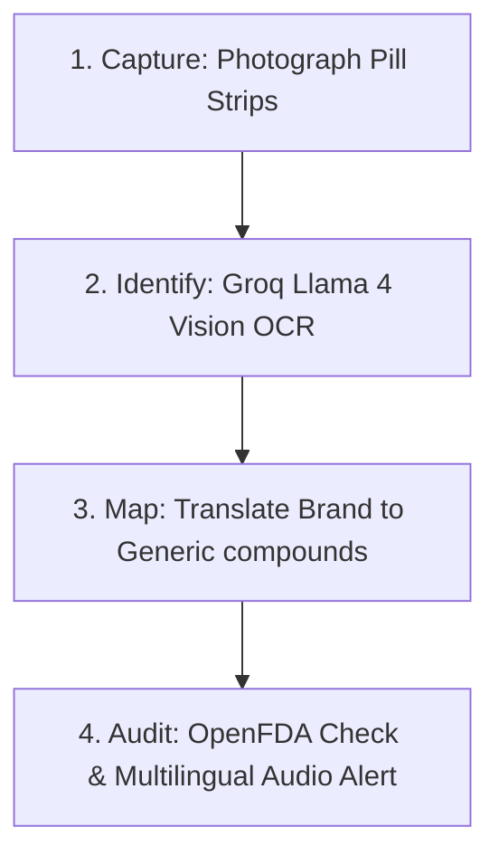

g# 🛡️ MedGuard

An AI-powered mobile-first pill strip scanner for elderly Indians that detects critical drug interactions and provides voice warnings in native languages.

## 📌 Problem Statement
Over 140 million elderly Indians take multiple daily medications (averaging 6 to 8 pills) to manage chronic health conditions. These medicines are frequently prescribed by different medical specialists who do not communicate, leading to a massive risk of severe, undetected drug interactions. Due to small printed text on pill strips and language barriers, seniors and their caregivers struggle to identify these lethal combination hazards before ingestion.

## 🚀 Key Features
* **Zero-Friction Camera OCR Scan**: Seniors just photograph their pill strips to start. No manual typing, complex form-filling, or app store installation required.
* **Groq Llama 4 Vision OCR**: Integrates visual analysis via Llama 4 Scout to accurately extract printed brand names from real-world pill strip images.
* **Generic Drug Mapping Database**: Translates popular Indian brand-name medicines (e.g., *Pantop 40*, *Ecosprin 75*, *Combiflam*) into their active chemical compounds using a local structured database ([drugs.json](file:///c:/Users/leena/OneDrive/Desktop/medguard/MedGuard/server/drugs.json)).
* **Automated FDA Interaction Audit**: Queries the OpenFDA database to detect warnings, contraindications, and potential side effects between all mapped chemical ingredients.
* **ConflictRAG NLI Classifier**: Processes extracted warnings to categorize interactions into distinct severity levels (e.g., high-risk, moderate, or minor conflict).
* **Multilingual Web Speech Audio Warnings**: Speaks critical instructions aloud in native Indian languages (English, Hindi, Malayalam, and Tamil) to accommodate visually impaired seniors.

---

## 🛠️ Tech Stack

| Layer | Technology | Key Function / Library |
| :--- | :--- | :--- |
| **Frontend** | React 19 + Vite 8 | UI Interface & Responsive Views |
| **Backend** | Node.js + Express | API Routing, Multipart Uploads |
| **OCR Model** | Groq Llama 4 Vision | Image Name Extraction |
| **Drug Database** | Local JSON Mapper | Brand-to-Generic Mappings |
| **Interaction API** | OpenFDA | Clinical Drug-Drug Conflicts |
| **Audio Engine** | Web Speech API | Multi-lingual Speech Synthesis |

---

## ⚙️ How It Works (The 4-Step Pipeline)



1. **Capture**: The user takes a picture of their pill strips using a smartphone camera.
2. **Identify**: The image is uploaded and parsed by the backend using Groq's Llama 4 Vision model to extract all visible medicine brand names.
3. **Map**: The server references the local mapping database to resolve brand names to their active generic ingredients (e.g. `Telma 40` -> `telmisartan`).
4. **Audit**: Mapped generics are analyzed for clinical conflicts using the OpenFDA API. If a conflict exists, a visual alert appears and the browser synthesizes voice warnings in the selected Indian language.

---

## 💻 How to Run Locally

### Prerequisites
* [Node.js](https://nodejs.org/) installed on your machine.
* A valid Groq Cloud API Key.

### 1. Set Up the Backend Server
Navigate to the `server` directory and set up configuration files:
```bash
cd server
npm install
```

Create a `.env` file in the `server` folder:
```env
PORT=3001
GROQ_API_KEY=your_groq_api_key_here
```

Start the backend:
```bash
node index.js
```
The server will start running at `http://localhost:3001`.

### 2. Set Up the Frontend Client
Open a new terminal window, navigate to the `client` directory, and launch the Vite development server:
```bash
cd client
npm install
npm run dev
```
The application will launch locally at the URL output by Vite (usually `http://localhost:5173`).

---

## 🖼️ Application Screenshots

*Add screenshots here of:*
1. *Pill strip upload UI screen*
2. *Real-time drug extraction overlay*
3. *Critical warning alert popup*
4. *Indian language selection panel*

---

## 👥 Hackathon Context & Team

**CSI Tech Genesis '26 Hackathon**  
**Theme**: Smart Cities, Sustainability & Social Impact

Developed by the **MedGuard Team**:
* **Martin Wills**: UI/UX Design & Frontend Engineering Lead
* **Ananthakrishnan Unni**: Data Engine & Machine Learning Mapping
* **Adwaith M**: Backend Server & OpenFDA API Architect
